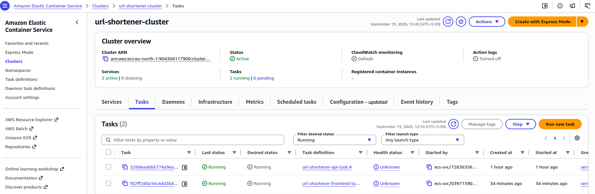
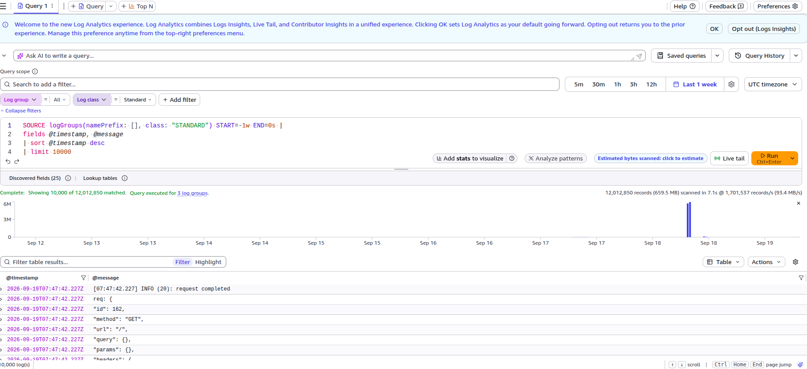
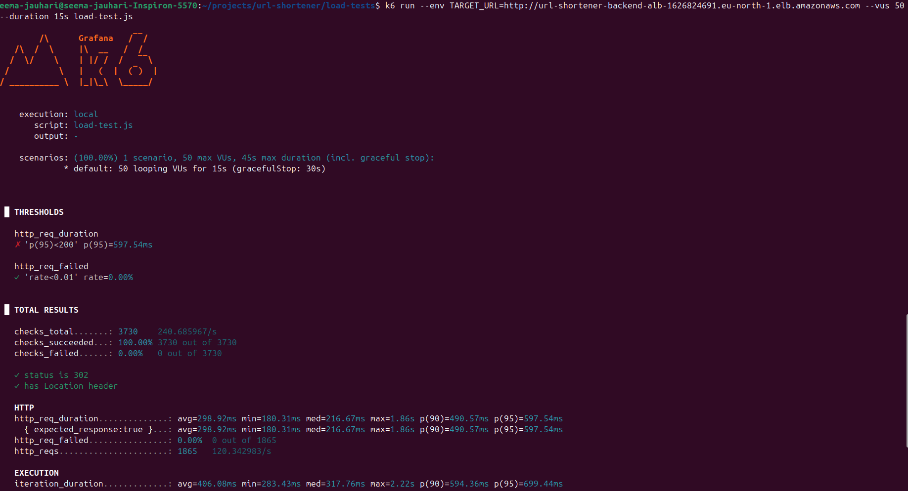
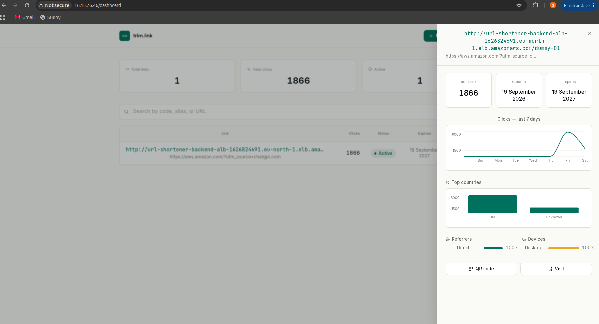

# AWS Deployment Guide — URL Shortener (MERN + Fargate)

## Screenshots

### AWS ECS Cluster (Fargate)


### CloudWatch Logs (debugging DocumentDB TLS connection)


### k6 Load Test Results


### Admin Dashboard



Personal setup notes for deploying a MERN-stack URL shortener to AWS using ECS Fargate, ECR, DocumentDB/MongoDB Atlas, and a containerized Redis cache.

**Region used:** `eu-north-1`
**AWS Account ID:** `894251738939`
**Default VPC:** `vpc-su348923847h23893`
**Default Security Group:** `sg-su348923847h23893`

---

## Table of Contents

1. [Architecture Overview](#1-architecture-overview)
2. [AWS CLI Setup](#2-aws-cli-setup)
3. [IAM: Access Keys & Permissions](#3-iam-access-keys--permissions)
4. [Docker → ECR: Build, Tag, Push](#4-docker--ecr-build-tag-push)
5. [Concept: Anatomy of a Docker Tag for ECR](#5-concept-anatomy-of-a-docker-tag-for-ecr)
6. [ECS Core Concepts](#6-ecs-core-concepts)
7. [Backend: Task Definition & Service](#7-backend-task-definition--service)
8. [Database: DocumentDB / MongoDB Atlas](#8-database-documentdb--mongodb-atlas)
9. [Caching: Redis Options](#9-caching-redis-options)
10. [Redis as a Sidecar Container](#10-redis-as-a-sidecar-container)
11. [Frontend: Task Definition & Service](#11-frontend-task-definition--service)
12. [Frontend → Backend Networking (nginx)](#12-frontend--backend-networking-nginx)
13. [Redeploy Checklist](#13-redeploy-checklist)
14. [Cost & Scope Notes (WAF / Route 53)](#14-cost--scope-notes-waf--route-53)

---

## 1. Architecture Overview

```
CloudFront → ALB → ECS (Fargate) → Redis → MongoDB
                                  ↘ SQS → analytics workers
```

- **CloudFront → ALB → ECS → Redis → MongoDB** is the core request path.
- **SQS** decouples analytics writes from the redirect path — the redirect response should never wait on analytics logging.
- **ECR** stores the Docker images; ECS Fargate pulls from it.
- **Secrets Manager** holds the JWT secret and MongoDB connection string (instead of hardcoding into env vars — a common beginner shortcut to avoid).
- **MongoDB Atlas** is used instead of an AWS-native DB — standard for MERN stacks and perfectly acceptable for interviews/resume purposes.

> See [§14](#14-cost--scope-notes-waf--route-53) for notes on WAF and Route 53, which are optional for a project at this scale.

---

## Environment Variables Strategy

This project uses two different approaches for managing environment variables, depending on whether they're consumed at **build time** (frontend) or **runtime** (backend).

### Frontend (Vite / React)

All `VITE_*` variables (e.g. `VITE_API_URL`) are **build-time** variables. Vite embeds their values directly into the compiled JavaScript bundle when `npm run build` runs — they cannot be changed after the image is built.

- Variables are defined in `frontend/.env.production`.
- This file is intentionally **excluded** from `.dockerignore`'s local-only rules, so it gets copied into the Docker build context and picked up automatically by Vite during the build step.
- No AWS ECS environment variable configuration is needed for these — they're baked into the static JS bundle at build time.
- To update a value (e.g. backend URL changes), edit `.env.production`, then rebuild and push (be sure to that you should be login if failed to push please try will login)a new image:
```bash
  docker build --platform linux/amd64 -t url-shortener-frontend ./frontend
  docker tag url-shortener-frontend:latest <ecr-repo-uri>:latest
  docker push <ecr-repo-uri>:latest
```

### Backend (NestJS)

All backend variables (`DATABASE_URI`, `REDIS_URI`, `DB_TLS`, etc.) are **runtime** variables, read via `process.env` when the container starts — not baked into the image.

- Locally: supplied via `.env.docker`, referenced through `env_file:` in `docker-compose.yml`.
- On AWS ECS: supplied directly as **Environment variables** in the Task Definition (or via an **Environment file** stored in S3, for a large number of variables).
- Since these are read at container startup rather than at build time, updating a value only requires creating a new Task Definition revision and forcing a new deployment — **no image rebuild needed**.

### Why the split

| | Frontend (`VITE_*`) | Backend (`process.env`) |
|---|---|---|
| Resolved at | Build time | Runtime |
| Source | `.env.production` (baked into image) |

## 2. AWS CLI Setup

```bash
sudo apt update
sudo apt install -y curl unzip
curl "https://awscli.amazonaws.com/awscli-exe-linux-x86_64.zip" -o "awscliv2.zip"
unzip awscliv2.zip
sudo ./aws/install

aws --version
```

Configure it:

```bash
aws configure
```

You'll be prompted for:

| Prompt | Value |
|---|---|
| AWS Access Key ID | from IAM (see [§3](#3-iam-access-keys--permissions)) |
| AWS Secret Access Key | from IAM (see [§3](#3-iam-access-keys--permissions)) |
| Default region name | `eu-north-1` |
| Default output format | `json` |

Verify credentials work:

```bash
aws sts get-caller-identity
```

---

## 3. IAM: Access Keys & Permissions

### Creating an access key

1. AWS Console → search **IAM** → **Users** → click your user
2. **Security credentials** tab → scroll to **Access keys**
3. Click **Create access key** → choose use case **Command Line Interface (CLI)**
4. Check the confirmation box → **Next** → **Create access key**
5. **Copy both values immediately** — the Secret Access Key is shown only once. If lost, you must generate a new key pair.

### Attaching permissions

For this project's IAM user (`url-shortener-24`):

1. IAM → Users → `url-shortener-24` → **Permissions** tab
2. Click **Add permissions** → **Attach policies directly**
3. Search and check **AdministratorAccess**
4. **Next** → **Add permissions**

`AdministratorAccess` covers everything needed here — ECR, ECS, ALB, VPC, CloudWatch, SQS, Secrets Manager, CloudFront — without hitting permission errors at each step.

### Permission Policy vs. Permission Boundary

These are often confused — they do very different things:

| Concept | What it does |
|---|---|
| **Permission policy** | The actual grant of access — "you *can* use ECS, ECR, S3." |
| **Permission boundary** | A ceiling/cap only — "no matter what gets attached later, you can *never* exceed this." Grants **zero** access by itself. |

A permissions boundary alone gives a user no abilities — you always need a separate permission policy attached for the user to do anything at all.

### If credentials stop working

1. IAM → Users → `url-shortener-24` → **Security credentials** tab
2. Check the access key is still **Active**
3. If unsure, just create a fresh one → CLI use case → copy both values carefully (watch for trailing spaces)
4. Re-run `aws configure` with the new values, then re-test with `aws sts get-caller-identity`

---

## 4. Docker → ECR: Build, Tag, Push

### Step 1 — Authenticate Docker to ECR

```bash
aws ecr get-login-password --region eu-north-1 | docker login --username AWS --password-stdin 894251738939.dkr.ecr.eu-north-1.amazonaws.com
```

### Step 2 — Build images

```bash
docker build -t url-shortener-api ./backend
docker build -t url-shortener-frontend ./frontend
```

### Step 3 — Tag for ECR

> Create the repository in the ECR console first, then use its name below.

```bash
docker tag url-shortener-api:latest 894251738939.dkr.ecr.eu-north-1.amazonaws.com/url-shortener-api:latest
docker tag url-shortener-frontend:latest 894251738939.dkr.ecr.eu-north-1.amazonaws.com/url-shortener-frontend:latest
```

### Step 4 — Push

```bash
docker push 894251738939.dkr.ecr.eu-north-1.amazonaws.com/url-shortener-api:latest
docker push 894251738939.dkr.ecr.eu-north-1.amazonaws.com/url-shortener-frontend:latest
```

### Notes

- **Why tagging is needed:** a locally built image is just named `url-shortener-api` on your machine. ECR doesn't know that name — it expects the image to carry its full repository URL so `docker push` knows exactly where to send it. Tagging = relabeling the image with ECR's address.
- **`:latest` is just a label**, not a magic keyword — Docker doesn't guarantee it's actually the newest build if you push out of order. Fine for a learning project doing manual single deployments; in real CI/CD, teams tag with a git commit hash or version number instead, so they can roll back to an exact image.
- **Multiple entries under one tag in ECR** (e.g. an "Image Index," a full-size image, and a 0.00 MB image) is normal for multi-platform builds — not a bug:
  - **Image Index** — a manifest list grouping platform-specific images (e.g. amd64/arm64) under one tag.
  - **Image (with size)** — the actual image for one platform.
  - **Image (0.00 MB)** — a second platform variant your build tooling (e.g. `docker buildx`) generated but didn't populate.

---

## 5. Concept: Anatomy of a Docker Tag for ECR

This command looks dense, but every segment is a distinct, meaningful part of an ECR address:

```
docker tag url-shortener-frontend:latest 894251738939.dkr.ecr.eu-north-1.amazonaws.com/url-shortener-frontend:latest
└────────────┬────────────┘ └──────────────────────────────┬──────────────────────────────┘
      SOURCE (local image)                            TARGET (full ECR image URI)
```

Breaking down the **target** (right-hand side), piece by piece:

```
894251738939 . dkr . ecr . eu-north-1 . amazonaws.com / url-shortener-frontend : latest
└─────┬─────┘   └───────────┬───────────┘   └──────┬──────┘   └───────┬──────┘ └──┬───┘
 AWS Account ID      Service subdomains        AWS Region      Repository name    Tag
 (which AWS acct       (dkr.ecr = the           (which data      (which repo     (which
  owns this repo)      ECR "docker registry"    center/zone      inside ECR       version
                        endpoint)                this lives in)   to push to)     of image)
```

| Segment | Example | What it means |
|---|---|---|
| **Account ID** | `894251738939` | The 12-digit ID of the AWS account that owns the ECR repository. Every account's registry has its own unique address — this is how AWS knows *whose* registry you're pushing to. |
| **`dkr.ecr`** | `dkr.ecr` | Fixed subdomain prefix meaning "this is the Docker registry endpoint of ECR" — always the same for any ECR repo. |
| **Region** | `eu-north-1` | The AWS region (data center zone) where this specific ECR repository lives. ECR repos are regional — a repo created in `eu-north-1` doesn't exist in `us-east-1`; you'd need to create/push a separate one there. This must match the `--region` you authenticated with in Step 1. |
| **`amazonaws.com`** | `amazonaws.com` | The root domain for all AWS service endpoints. |
| **Repository name** | `url-shortener-frontend` | The specific ECR repository (like a folder/namespace) inside your account+region — this must already exist in the ECR console before you push to it. |
| **Tag** | `:latest` | The version label for this particular image inside the repository, so you can distinguish `:latest` from `:v1`, `:v2`, a commit hash, etc. |

So the full string is really just: **"account → registry service → region → which repo → which version."** The `docker tag` command doesn't move or copy any image data — it just gives your existing local image a *second name* (this full ECR address) so that `docker push` knows exactly which account, region, and repository to send the actual bytes to.

You can confirm which account/region you're authenticated against at any time with:

```bash
aws sts get-caller-identity
```

---

## 6. ECS Core Concepts

| Term | Meaning |
|---|---|
| **Cluster** | A logical grouping/namespace where tasks and services run — the "environment" holding all your app's running containers. |
| **Task definition** | A blueprint describing what to run: image, CPU/memory, ports, env vars. Not running anything yet — just the spec. |
| **Container name** (inside a task def) | A label identifying one container within a task, since a task can hold multiple containers (e.g. app + sidecar). Needed for logs, port mapping, etc. |
| **Service** | Keeps task(s) running continuously — monitors, auto-restarts on crash, and manages how many replicas run. The task definition is the blueprint; the service is what keeps it alive. |

**Flow:** Cluster (environment) → Task Definition (blueprint) → Service/Task (running instance of that blueprint, placed inside the cluster).

### Launch type options

| Option | Best for |
|---|---|
| **Fargate** | AWS manages the underlying servers — you just define CPU/memory, AWS runs the containers. **(Used for this project.)** |
| **EC2** | You rent and manage a full VM yourself (patching, scaling, security). |
| **Lambda** | Event-driven, short-lived code (seconds–minutes), billed per invocation. Not suitable for a long-running API that must serve redirects/WebSocket connections continuously. |
| **EKS** | Real Kubernetes — powerful but overkill/harder to learn for a small project. ECS is simpler and sufficient here. |

> Pick **Fargate** launch type specifically — not "Capacity provider strategy," which is an advanced feature for mixing Fargate + Fargate Spot/EC2 to optimize cost. Unnecessary complexity for a learning project.

---

## 7. Backend: Task Definition & Service

### Create the cluster

- ECS Console → **Clusters** → **Create cluster**
- Name: `url-shortener-cluster`
- Infrastructure: check **AWS Fargate (serverless)**

### Create the task definition

- ECS → **Task definitions** → **Create new task definition**
- Family: `url-shortener-api-task`
- Launch type: **AWS Fargate**
- OS: **Linux/X86_64**
- Task size: `0.25 vCPU`, `0.5 GB` (fine for learning)
- Container:
  - Name: `api`
  - Image URI: `894251738939.dkr.ecr.eu-north-1.amazonaws.com/url-shortener-api:latest`
  - Port mapping: your app's port (e.g. `3000`)
  - Environment variables: MongoDB URI, JWT secret, etc.

### Create the service

- Cluster → **Service** tab → **Create**
- Launch type: **Fargate**
- Task definition: the one just created
- Desired tasks: `1`
- Networking: your VPC, public subnets, a security group allowing inbound on your app's port
- ALB attachment: optional at this stage, added later
- **Check all logs in the Service tab** once running.

---

## 8. Database: DocumentDB / MongoDB Atlas

*(Steps below are for DocumentDB; MongoDB Atlas is the alternative actually chosen for this project — see [§1](#1-architecture-overview).)*

1. **Create cluster:** AWS Console → search **DocumentDB** → **Create cluster**
   - Cluster type: **Instance-based cluster** (simpler for learning)
   - Engine version: default
   - Instance class: `db.t3.medium` (covered by free trial)
   - Number of instances: `1`
   - Cluster identifier: `url-shortener-docdb`
   - Save the master username/password somewhere safe
2. **Network settings:**
   - VPC: same VPC as ECS (must match, or they can't talk to each other)
   - Subnet group: default is fine
   - Security group: allow inbound on port `27017` **only from your ECS task's security group** — not from the internet, keep the DB private
3. **Create** — provisioning takes a few minutes
4. **Get connection string:** Cluster → **Connectivity & security** tab → copy the endpoint

### Gotcha: passwords with special characters

If your password contains characters like `#`, `@`, `?`, `&`, URL-encode **only the password** before dropping it into `DATABASE_URI` — encoding the *entire* connection string is wrong, since it would also encode the `://`, `@`, `?` delimiters that need to stay literal.

```bash
node -e "console.log(encodeURIComponent('yourpassword'))"
```

---

## 9. Caching: Redis Options

### Option A — ElastiCache (managed, paid)

- AWS Console → **ElastiCache** → **Create cache**
- Engine: **Redis OSS** (not Memcached)
- Deployment: **Design your own cache** → **Serverless** (simplest), or **Cluster mode disabled** with a single small node (`cache.t3.micro`) for more control
- Cluster name: `url-shortener-redis`
- VPC: same as ECS/DocumentDB
- Security group: allow inbound on port `6379` from your ECS task's security group only
- Once created, copy the **Primary endpoint**

Env vars for the ECS task:

```
REDIS_HOST=<primary-endpoint>
REDIS_PORT=6379
```

**Cost note:** ElastiCache has no meaningful free tier for serverless usage; a `cache.t3.micro` node is cheap (~$0.017/hr ≈ $12/month if left running). Delete it when done testing.

### Cheaper/free alternatives

| Option | Description | Cost |
|---|---|---|
| **EC2-hosted Redis** | Launch a free-tier `t2.micro`/`t3.micro`, run Redis via Docker, point `REDIS_HOST` to its private IP | $0 within free tier |
| **Redis Cloud (Upstash)** | Genuinely free tier (10,000 commands/day, 256MB), no AWS involvement | $0 |
| **Redis sidecar container** *(chosen for this project)* | Add a `redis` container to the existing ECS task, connect via `localhost:6379` | $0 extra (same Fargate task, slightly more CPU/memory) |

The sidecar approach is the simplest and cheapest for a learning project: cache loss on restart is fine since MongoDB is the source of truth anyway, and it still demonstrates the caching pattern.

---

## 10. Redis as a Sidecar Container

### Step 1 — Add the Redis container to the task definition

- ECS → **Task Definitions** → `url-shortener-api-task` → select latest revision → **Create new revision**
- **Container definitions** → **Add container**:
  - Name: `redis`
  - Image URI: `redis:7-alpine` (official public image, no ECR needed)
  - Port mapping: container port `6379`, protocol `TCP` (leave port name/app protocol blank)
- **Important:** bump task size since two containers now share the task — at least `0.5 vCPU` / `1 GB` (the original `0.25/0.5` is too small for two).

### Step 2 — Update the api container's env vars

Containers in the same task share `localhost`, so:

```
REDIS_HOST=127.0.0.1
REDIS_PORT=6379
```

### Step 3 — Save as a new revision, then update the Service

- ECS → Cluster → Services → your service → **Update**
- Select the new revision → check **Force new deployment** → **Update**

### Step 4 — Verify

- Tasks tab → open the running task → confirm **two containers** (`api`, `redis`)
- Check `api` logs — `ECONNREFUSED 127.0.0.1:6379` errors should be gone

> No persistent volume means cached data is lost on restart — expected and fine; the app should re-fetch/rebuild cache from MongoDB naturally.

---

## 11. Frontend: Task Definition & Service

### Step 1 — Confirm image is pushed

Check the `url-shortener-frontend` repo in the ECR console.

### Step 2 — Create task definition

- Family: `url-shortener-frontend-task`
- Launch type: **Fargate**
- OS: **Linux/X86_64**
- Task size: `0.25 vCPU` / `0.5 GB` (lightweight static files via Nginx)
- Container:
  - Name: `frontend`
  - Image URI: `894251738939.dkr.ecr.eu-north-1.amazonaws.com/url-shortener-frontend:latest`
  - Port mapping: **80** (confirmed via Dockerfile — see note below, *not* `5173`)
  - Env vars: `BACKEND_HOST` / `BACKEND_PORT` (see [§12](#12-frontend--backend-networking-nginx))

### Step 3 — Create service

- Launch type: **Fargate**
- Task definition: the new frontend one
- Desired count: `1`
- Networking: same VPC, public subnet, **enable auto-assign public IP**
- Security group: use the existing default SG (`sg-su348923847h23893`) — add an inbound rule for port `80`, source `0.0.0.0/0` (VPC Console → Security Groups → edit inbound rules → Custom TCP or HTTP, port 80)

### Step 4 — Test

Open `http://<frontend-task-public-ip>` and confirm the dashboard loads and reaches the backend API.

> **Where to find "Public IP":** ECS → Cluster → Tasks → select task → **Configuration** tab.

### Important port note

If the frontend Dockerfile has multiple `FROM` stages (a Node build stage + an Nginx serve stage), the image pushed to ECR is the **Nginx production image**, which serves on port **80** — regardless of the dev server running on `5173` locally. ECS deployment should mirror production, not local dev convenience, so the container port mapping is `80`.

---

## 12. Frontend → Backend Networking (nginx)

### The problem

Locally, `docker-compose.yml` gives you automatic internal DNS — `proxy_pass http://api:3000/;` resolves because Compose creates a DNS entry for each service name (`api`) within its network.

On ECS, there's no Compose orchestrator. Frontend and backend are separate tasks with separate IPs — Nginx has no way to resolve `api` as a hostname unless you set up Service Discovery/Cloud Map (not used here).

### The fix: templated nginx config with `envsubst`

**1. Rename `frontend/nginx.conf` → `frontend/nginx.conf.template`**, and parameterize the backend address:

```nginx
server {
    listen 80;
    root /usr/share/nginx/html;
    index index.html;

    location /api/ {
        proxy_pass http://${BACKEND_HOST}:${BACKEND_PORT}/;
        proxy_set_header Host $host;
        proxy_set_header X-Real-IP $remote_addr;
        proxy_set_header X-Forwarded-For $proxy_add_x_forwarded_for;
        proxy_set_header X-Forwarded-Proto $scheme;
    }

    location / {
        try_files $uri $uri/ /index.html;
    }
}
```

**2. Update `frontend/Dockerfile`** to copy the template into Nginx's auto-substitution folder:

```dockerfile
FROM nginx:alpine
COPY --from=build /app/dist /usr/share/nginx/html
COPY nginx.conf.template /etc/nginx/templates/default.conf.template
EXPOSE 80
```

> Must go to `/etc/nginx/templates/` (not directly to `/etc/nginx/conf.d/`) — that specific folder is what triggers the official `nginx:alpine` image's built-in startup script to run `envsubst` on any `*.template` file, writing the result to `/etc/nginx/conf.d/default.conf` before Nginx launches.

**3. Set the values per environment:**

| Environment | Where set | Values |
|---|---|---|
| Local (`docker-compose.yml`) | `environment:` section of the `frontend` service | `BACKEND_HOST=api`, `BACKEND_PORT=3000` |
| ECS | Task Definition → frontend container → environment variables | `BACKEND_HOST=<backend public IP or ALB DNS>`, `BACKEND_PORT=3000` |

Both the code change (making the image accept these vars) **and** the env var values (actually providing them at runtime) are required — one without the other doesn't work.

### Compose env var precedence (for reference)

1. `environment:` set directly in `docker-compose.yml` — highest priority
2. `env_file:` referenced file — used if not overridden above
3. Shell environment variables on the host (if referenced via `${VAR}` substitution in the compose file itself)

### Caveat on using a raw public IP

The backend task's public IP **changes on every restart/redeploy** — using it directly means updating and rebuilding the frontend image each time. **Resolved in [§15](#15-alb-stable-backend-routing)** with an ALB providing a stable DNS name.
---

## 13. Redeploy Checklist

Whenever frontend or backend code changes, repeat this every time — Docker doesn't track "what changed," so always rebuild the full image:

```bash
# 1. Re-authenticate to ECR (if the token expired)
aws ecr get-login-password --region eu-north-1 | docker login --username AWS --password-stdin 894251738939.dkr.ecr.eu-north-1.amazonaws.com

# 2. Rebuild the image
docker build --platform linux/amd64 -t url-shortener-frontend ./frontend

# 3. Tag it
docker tag url-shortener-frontend:latest 894251738939.dkr.ecr.eu-north-1.amazonaws.com/url-shortener-frontend:latest

# 4. Push
docker push 894251738939.dkr.ecr.eu-north-1.amazonaws.com/url-shortener-frontend:latest
```

Then in the ECS console:

1. Go to **Service → Update**
2. Check **Force new deployment** — re-pulls the `:latest` image from ECR
3. Click **Update**
4. Wait for the new task to reach **RUNNING**, check logs to confirm

> A **new task definition revision** is only required if you're changing env vars, ports, or resource sizing. For pure code/image changes on the same `:latest` tag, **Force new deployment** alone is enough.

---

## 14. Cost & Scope Notes (WAF / Route 53)

| Service | Verdict for this project |
|---|---|
| **WAF** | Technically correct to include, but usually the last thing added — mostly matters when an API is a serious public target (bot abuse, scraping). For an internal/learning tool, it's "nice to have learned," not "must deploy." Knowing what it does and why is enough at this stage. |
| **Route 53** | Only useful if you actually buy a domain (~$12/year). If avoiding that cost, skip it and just note the design as "ready for a Route 53 custom domain" without provisioning one. |

## 15. ALB: Stable Backend Routing
 [ALB: Stable Backend Routing](#15-alb-stable-backend-routing)

### The problem it solves

Every ECS Fargate task restart (redeploy, crash recovery, scaling event) assigns a **new public IP**. Since the frontend's Nginx config points at the backend via `BACKEND_HOST`, every restart broke the frontend until the IP was manually updated and the image rebuilt — as documented in [§12](#12-frontend--backend-networking-nginx). An Application Load Balancer (ALB) fixes this permanently by giving the backend one **stable DNS name** that always routes to whichever task is currently healthy.

> ALB is a load balancer in the literal sense — with multiple backend tasks, it distributes traffic across them. With a single task (as in this project), that distribution function is dormant, but its secondary function — always knowing the current healthy target's address — is what's actually being used here.

### Step 1 — Create the target group

- EC2 Console → **Target Groups** → **Create target group**
- Target type: **IP addresses** (required for Fargate — tasks don't have persistent EC2 instances to target)
- Name: `url-shortener-api-tg`
- Protocol: **HTTP**, Port: `3000`
- VPC: default VPC
- Health check path: `/` (or a real health endpoint, e.g. `/health`)
- Skip "Register targets" — ECS auto-registers once connected in Step 3
- **Create target group**

### Step 2 — Create the ALB

- EC2 Console → **Load Balancers** → **Create load balancer** → **Application Load Balancer**
- Name: `url-shortener-backend-alb`
- Scheme: **Internet-facing**
- VPC: default VPC, select **at least 2** public subnets across different Availability Zones (ALB requires this for high availability — cost is unaffected by choosing 2 vs 3)
- Security group: existing default SG — ensure inbound **port 80** allowed from `0.0.0.0/0`
- Listener: **HTTP : 80** → forward to → `url-shortener-api-tg`
- **Create load balancer**

### Step 3 — Connect the ALB to the ECS service

- ECS → Cluster → backend Service → **Update**
- **Load balancing** section → check **Application Load Balancer**
- Select `url-shortener-backend-alb`
- Listener/target group: `url-shortener-api-tg`
- Container to load balance: `api`, port `3000`
- Check **Force new deployment** → **Update**

### Step 4 — Get the stable address

- EC2 → Load Balancers → click `url-shortener-backend-alb` → copy the **DNS name**, e.g.: url-shortener-backend-alb-1626824691.eu-north-1.elb.amazonaws.com


### Step 5 — Update the frontend

Set in the frontend Task Definition:

BACKEND_HOST=url-shortener-backend-alb-1626824691.eu-north-1.elb.amazonaws.com
BACKEND_PORT=80

> No `http://` prefix on `BACKEND_HOST` — the nginx template already adds it (`proxy_pass http://${BACKEND_HOST}:${BACKEND_PORT}/;`). Including it produces a malformed `http://http://...` upstream and nginx fails to start with `invalid port in upstream`.

This value **never needs to change again**, regardless of how many times the backend task restarts, crashes, or redeploys — the ALB always resolves to whichever task is currently healthy.

### Load Balancer types — quick reference

| Type | Layer | Use case | Relevant here? |
|---|---|---|---|
| **ALB** | 7 (HTTP/HTTPS) | Understands URLs/paths/headers, routes accordingly | ✅ Yes — used for stable backend routing |
| **NLB** | 4 (TCP/UDP) | Ultra-low latency, millions of req/sec, no content awareness | No — overkill, no HTTP-routing benefit needed |
| **GWLB** | 3 | Routes traffic through third-party firewall/security appliances | No — no security appliance layer in this project |
| **CLB** | Legacy | Pre-2016, superseded by ALB/NLB | No — deprecated, AWS steers new projects to ALB |


## fix: ensure VITE_API_URL is available at Vite build time in Docker

**`.env.production`** — values needed for the app to *function correctly*, but not secret. `VITE_API_URL` is exactly this case: your Dashboard code reads `import.meta.env.VITE_API_URL` to know where to send API calls. Vite bakes this into the compiled JS bundle at `npm run build` time. This file **must** be present and correct inside the Docker build context, or `SHORTENER_DOMAIN` ends up `undefined` at build time (which was your original access problem) — since there's no runtime way to inject it afterward, unlike a backend env var. Since it's just a URL (not a credential), it's safe to commit.

**`.env.production.local`** — for anything actually sensitive that still happens to be needed at *frontend build time* — e.g. a public analytics key with a paid tier, a Sentry DSN, a third-party API key you don't want casually visible in your git history even though it ends up in the bundle anyway. It's gitignored by default in Vite, so it never gets committed, but you (or your CI pipeline) still create it manually on whatever machine runs `npm run build`, right alongside `.env.production`. Vite merges both files at build time — `.local` values override `.env.production` if both define the same key.

**Why you need `.env.production.local` excluded from `.dockerignore`'s "keep out" list, i.e. why it still needs to reach the Docker build context if it exists:**
Since frontend env vars are **build-time only**, if `.env.production.local` holds a value the app needs, it must be present when `docker build` runs `npm run build` inside the container — otherwise that variable is missing from the compiled bundle, same failure mode as your original `VITE_API_URL` bug. So both `.env.production` and `.env.production.local` need to reach the build context; only `.env.production.local` itself needs to stay out of **git** (via `.gitignore`), not out of the Docker build.

**Why the backend doesn't need this split at all:**
Backend env vars (`DATABASE_URI`, `JWT_SECRET`, `REFRESH_SECRET`) are read via `process.env` **at container startup**, not baked into any build artifact. They never need to touch the Docker build context or the image itself — they're injected live when the container runs, either via ECS Task Definition environment variables or `env_file:` in `docker-compose.yml`. Since nothing backend-related gets compiled into a static bundle, there's no reason to distinguish "safe to bake into the image" vs "needs local-only override at build time" — the whole build-vs-runtime split that makes frontend `.env.production` vs `.env.production.local` meaningful simply doesn't apply on the backend. That's why this pattern is frontend-specific.